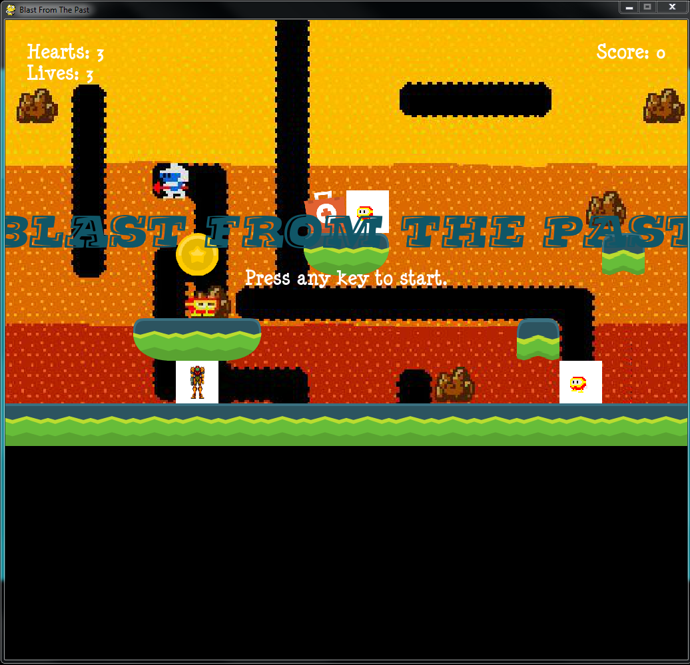
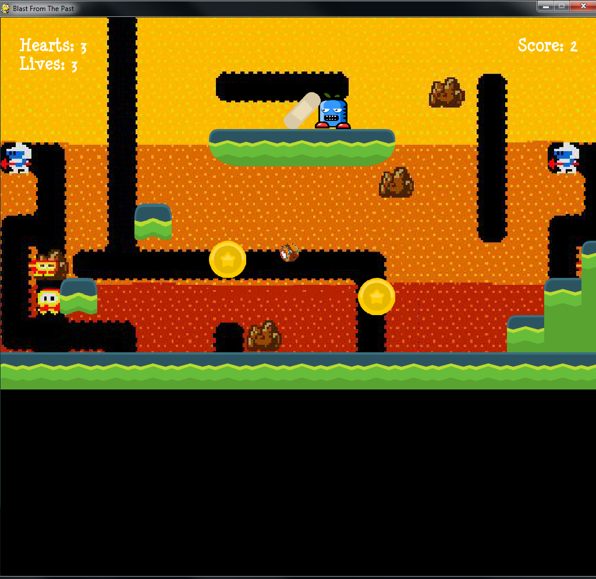

# Blast From The Past
## Techincal Info
- This game was created using Python 3.6.1 and Pygame 2.7
 ### Python 3 Download Instructions
- [Python Download Link](https://www.python.org/downloads/)
- [Pygame Download Link](http://www.pygame.org/download.shtml)
- [Game Download Link](https://github.com/Jae1198/platformercompprog.git)
# Instructions
## Movement
- Use A and D keys to move
- Use Spacebar to Jump
- When it says press any key to start it literally means any key. Escape & function keys are included in that.

## Powerups & Coins
- Coins Increase Your Score by 2.
- When your character has 100 coins then your lives will increase by one.
- Red Hearts give you more health and green hearts give you an extra life.
- The intertwining Snakes cuts your speed by 3/4
## Enemies
- Frygar (Green Enemies) Go back and forth between edges and don't fall off of edges
- Pooka (Orange Enemies) Go back and forth between edges and drop down onto lower levels
## Goals
 - Get to the flag at the end of each level.
 - There are 3 levels after you have gotten to all the flags you win.
